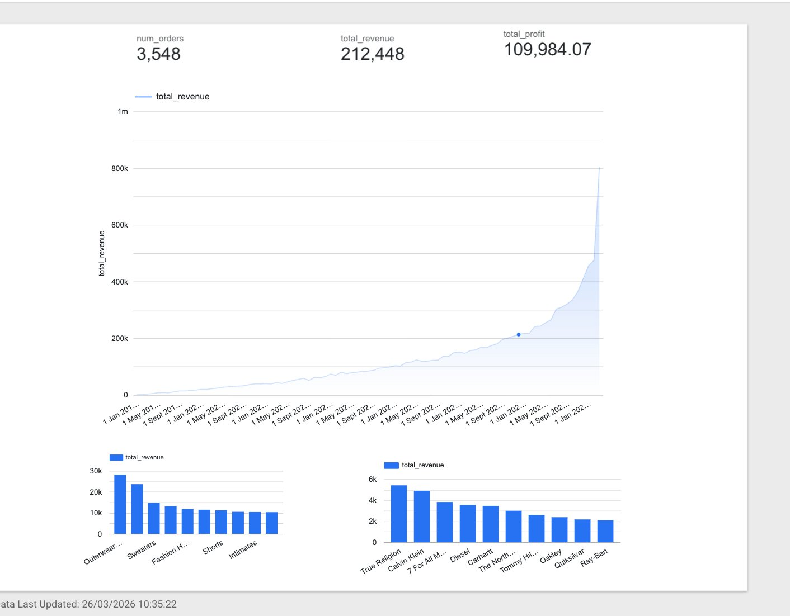
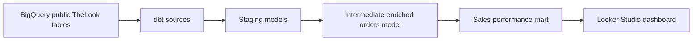
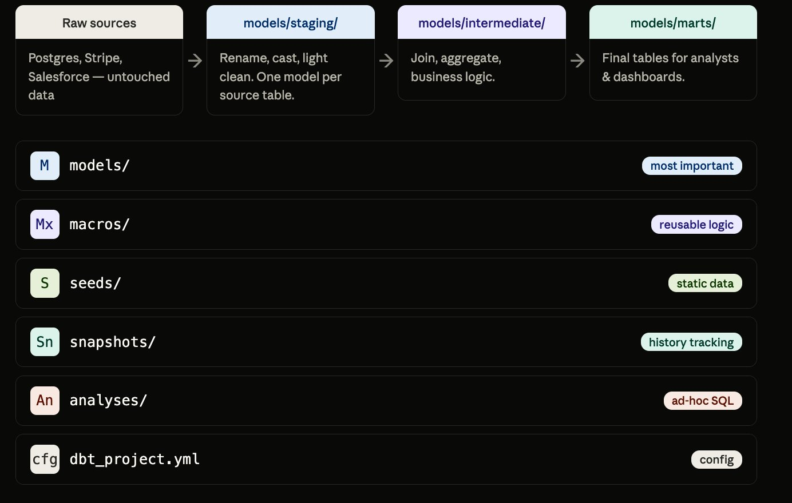

# March Analytics

A dbt and BigQuery analytics engineering project that models TheLook Ecommerce data into a tested sales performance mart and Looker Studio dashboard.



## Problem

Raw ecommerce tables are useful for storage, but awkward for business analysis. Sales questions usually require repeated joins across orders, order items, products, and customer attributes, plus careful filtering for cancelled or returned orders.

This project builds a clean analytics layer that lets an analyst answer revenue, order volume, product, department, brand, and customer-segment questions from one final mart.

## Dataset / Source

The project uses the public BigQuery dataset `bigquery-public-data.thelook_ecommerce`.

| Source table | Role in project |
|---|---|
| `orders` | Order status and timestamps |
| `order_items` | Item-level sale price and order linkage |
| `products` | Product category, brand, department, and cost |
| `users` | Customer attributes available for segmentation |
| `events` | Website activity available for future behavioral analysis |
| `inventory_items` | Inventory and stock context |
| `distribution_centers` | Warehouse and fulfillment context |

## Tech Stack

| Tool | Purpose |
|---|---|
| dbt Fusion 2.0 | SQL transformation and project structure |
| Google BigQuery | Cloud data warehouse |
| Looker Studio | Dashboard and visualization |
| Python 3.11 | Local virtual environment |
| Git / GitHub | Version control |

## Architecture / Workflow



## Project Structure

```text
models/
|-- staging/
|   |-- sources.yml
|   |-- schema.yml
|   |-- stg_orders.sql
|   |-- stg_order_items.sql
|   `-- stg_products.sql
|-- intermediate/
|   `-- int_orders_enriched.sql
`-- marts/
    `-- mart_sales_performance.sql
tests/
    `-- assert_mart_excludes_cancelled_and_returned_orders.sql
```

## Data Model

The final mart, `mart_sales_performance`, aggregates order-item data by time, product, order status, and customer gender.

Key metrics include:

- `num_orders`
- `num_items_sold`
- `total_revenue`
- `avg_item_price`
- `avg_order_value`
- `total_cost`
- `total_profit`

Returned and cancelled orders are filtered out of the mart so dashboard metrics reflect completed commercial activity.

## Results / Hiring Evidence

- Built a source-to-mart dbt workflow on BigQuery public ecommerce data.
- Created staging models for orders, order items, and products.
- Joined order, product, and customer fields into an intermediate enriched model.
- Built a business-facing sales performance mart for dashboard consumption.
- Added 12 schema tests across staging models and a regression test for the final mart.
- Connected the final model to a Looker Studio sales dashboard.



## Data Quality Tests

Twelve schema tests are defined in `models/staging/schema.yml`. A singular regression test in `tests/` confirms that cancelled and returned orders never reach the final mart.

| Model | Column | Tests |
|---|---|---|
| `stg_orders` | `order_id` | unique, not_null |
| `stg_orders` | `user_id` | not_null |
| `stg_orders` | `status` | not_null, accepted_values |
| `stg_order_items` | `order_item_id` | unique, not_null |
| `stg_order_items` | `order_id` | not_null |
| `stg_order_items` | `sale_price` | not_null |
| `stg_products` | `product_id` | unique, not_null |
| `mart_sales_performance` | `order_status` | excludes cancelled and returned orders |

Run tests with:

```bash
dbt test
```

## How to Run

1. Clone the repository.

```bash
git clone https://github.com/LukeOpany/march-analytics.git
cd march-analytics
```

2. Create and activate a virtual environment.

```bash
python3.11 -m venv venv
source venv/bin/activate
```

3. Install the BigQuery adapter.

```bash
pip install dbt-bigquery
```

4. Configure `~/.dbt/profiles.yml`.

```yaml
march_analytics:
  target: dev
  outputs:
    dev:
      type: bigquery
      method: service-account
      project: your-gcp-project-id
      dataset: dbt_march
      threads: 4
      keyfile: /path/to/service-account-key.json
      location: US
```

5. Run and test the project.

```bash
dbt debug
dbt run
dbt test
```

## What I Learned / Production Improvements

This project demonstrates:

- How to model ecommerce data into an analyst-friendly mart.
- How to use dbt `source()` and `ref()` for lineage.
- How to keep transformations modular with staging, intermediate, and mart layers.
- How to make dashboard metrics more reliable by filtering non-completed orders.

Production next steps:

- Add source freshness checks for upstream tables.
- Add CI to run `dbt parse`, `dbt build`, and tests on pull requests.
- Expand marts for customers, inventory, and acquisition funnel analysis.
- Publish dbt docs for easier lineage review.
- Parameterize deployment targets for dev/prod BigQuery datasets.
